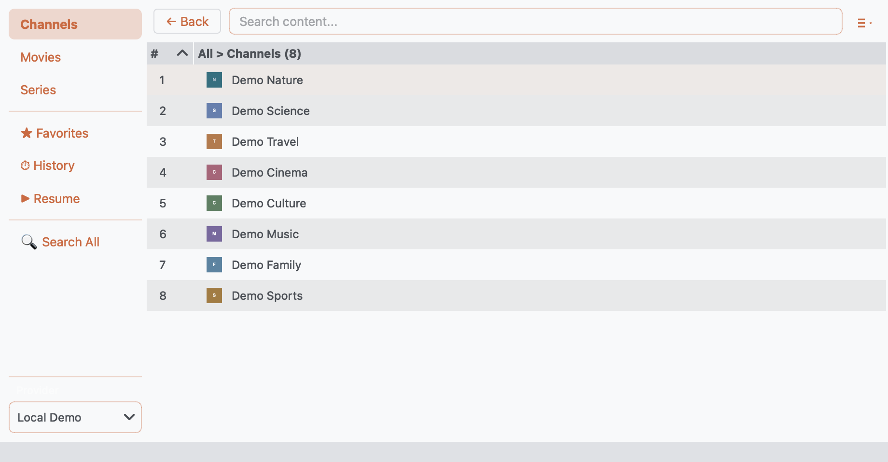
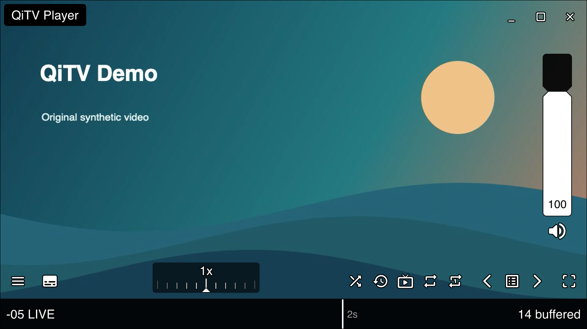

# QiTV — IPTV and STB Client

QiTV is a free, open-source IPTV player for Windows, macOS, and Linux. Watch live TV, movies, and series from M3U playlists, Xtream accounts, or STB providers.

> This README describes the 1.14 development version. Published releases may have different features and requirements.

## Features

- **Your providers in one app:** add multiple providers and switch between them from the sidebar.
- **Live TV, movies, and series:** browse categories, search content, and view program guides and movie details when available.
- **Favorites and history:** keep favorites close, revisit recently watched content, or resume your last session.
- **Search All:** search previously loaded catalogs across providers.
- **Bundled player:** MPV with on-screen controls, subtitles, audio-track selection, fullscreen, and picture-in-picture. Installed VLC or your own MPV are also supported.
- **Continue watching:** resume movies and episodes, auto-play the next episode, or get a next-movie suggestion with the internal player.
- **Opt-in live time-shift:** rewind non-seekable live TV using bounded temporary disk history; catch up with MPV's playback-speed control.
- **M3U export and portable mode:** use your playlists in other players or keep QiTV's settings alongside the app.



*Screenshots use fictional channels and original generated video.*

## Installation

Download QiTV from the official [Releases page](https://github.com/ozankaraali/QiTV/releases). Avoid untrusted third-party distributions.

The 1.14 builds include MPV; no separate player installation is needed for internal playback.

| Platform | Requirements for 1.14 |
| --- | --- |
| Windows | Windows 10 or newer, x64 |
| macOS | macOS 13 or newer; choose Intel or Apple Silicon |
| Linux | x86-64, glibc 2.35 or newer, X11 or XWayland |

For source installation, see [Running from source](#running-from-source).

### Linux application menu

To add a downloaded Linux binary to your application menu:

```bash
git clone https://github.com/ozankaraali/QiTV/
cd QiTV
./scripts/install-linux.sh /path/to/qitv-linux
```

The installer copies the binary to `~/.local/bin` and installs a desktop entry and icon. No root access is required.

If QiTV reports a Qt/xcb plugin error, install `libxcb-cursor0` on Debian/Ubuntu or `xcb-util-cursor` on Fedora.

## Getting started

QiTV starts with the public [iptv-org playlist](https://github.com/iptv-org/iptv). You can remove it in Settings if you only want to use your own providers.

1. Open **File → Settings → Providers**.
2. Click **Add Provider**, give it a name, and choose the stream type:

   | Stream type | What to enter |
   | --- | --- |
   | **M3U Playlist** | A playlist URL, or use **Load File** for a local playlist |
   | **M3U Stream** | A direct stream URL |
   | **Xtream** | Server URL, username, and password |
   | **STB** | Server URL and MAC address; serial number and device ID only if your provider requires them |

3. Use **Verify Provider** to check the connection, then **Save**.
4. Select the provider in the sidebar. Choose **Channels**, **Movies**, or **Series**, depending on what it offers.
5. Double-click an item or press **Enter** to open it. Use **Back** to return to the previous list.

### Browsing and organizing

- **Search:** filter the current list with the search box. Enable **Edit → Search Descriptions** to include available descriptions.
- **Search All:** search across providers' previously loaded catalogs. Enter at least three characters.
- **Favorites:** right-click an item to add or remove it, then use **Favorites** in the sidebar.
- **History / Resume:** open **History** to replay an item or clear your history; use **Resume** to return to the last watched item.
- **Refresh:** catalogs refresh automatically. Use **Edit → Update Content** when you want to reload immediately.
- **Local media:** use **File → Open File** to play a file without adding a provider.

### Playback

Choose a player under **View → Play with**, or from the menu beside the search box.

| Mode | Behavior |
| --- | --- |
| **Internal (Bundled MPV)** | Opens a separate video window with [uosc](https://github.com/tomasklaen/uosc) controls. No installation needed; your personal MPV settings are left untouched. |
| **VLC (External)** | Opens your installed VLC. |
| **MPV (User Configuration)** | Opens your installed MPV with your own settings and scripts. |

In the internal player, use the timeline to seek and right-click for subtitles, audio tracks, and other playback options.

| Shortcut | Internal player action |
| --- | --- |
| **Space** | Play / pause |
| **M** | Mute / unmute |
| **F** or double-click the video | Fullscreen |
| **Alt+P** | Picture-in-picture |

Enable **Keyboard/Remote Mode** in Settings to use **Up/Down** to switch between playable items.

The internal player saves movie and episode progress and offers **Resume** or **Start Over** when you return. Settings also lets you enable or disable next-episode autoplay and next-movie suggestions, each with a countdown you can cancel. QiTV's saved-position resume and autoplay controls do not apply to external players.

### Live time-shift

Enable **Settings → Time-shift** and choose how much disk space to use (default **2 GiB**). The slider shows estimated rewind time.

- Use the player timeline to rewind, playback speed to catch up, and **Go live** to return to live.
- For streams that do not buffer automatically, choose **Time-shift → Buffer this stream** in the player.

Works with **Internal/Bundled MPV**. The oldest history is replaced when the cache fills. Stop, changing channels, or closing QiTV clears the cache; this is not permanent recording.



### Program guide and content details

In **Settings → EPG**, choose **STB** for a guide supplied by an STB or Xtream provider, or choose **Local File** or **URL** for an XMLTV guide. XMLTV mappings let you match guide entries to channels.

Enable **View → Show EPG** to see program information. **Show VOD Info** and **Show Info Panel** control movie/series details and the details panel. Guide data, artwork, and descriptions depend on your provider.

### Exporting playlists

Use **File → Export**, also available from the menu beside the search box:

- **Export Shown Channels:** export the current channel list.
- **Export Cached Content:** export content already loaded from the provider.
- **Export Complete (Fetch All):** fetch all seasons and episodes before exporting STB series.
- **Export All Live Channels:** export the loaded live-channel catalog for an STB provider.

Exports use M3U format. Stream availability and authentication still depend on the provider.

### Portable mode

Create an empty `portable.txt` beside the QiTV executable—or beside `main.py` when running from source—to store settings and cache in that directory. The directory must be writable.

Otherwise, QiTV uses:

| Platform | Settings and cache directory |
| --- | --- |
| Windows | `%APPDATA%\qitv` |
| macOS | `~/Library/Application Support/qitv` |
| Linux | `~/.config/qitv` |

## Running from source

Source installs require **Python 3.14** and native build tools for the bundled player. For normal use, download a release instead.

<details>
<summary>Source setup and build requirements</summary>

Install [uv](https://docs.astral.sh/uv/getting-started/installation/), Git, Go 1.21 or newer, and the tools for your platform:

- **macOS:** Xcode 15 or newer command-line tools, plus `brew install cmake ninja nasm autoconf autoconf-archive automake libtool pkgconf`.
- **Linux:** a C/C++ compiler, CMake, Ninja, NASM, pkg-config, Autotools, and X11/OpenGL/ALSA/PulseAudio development headers. See the Ubuntu package list in the [build workflow](.github/workflows/main.yml).
- **Windows:** an x64 Visual Studio developer shell, LLVM (`clang`, `clang++`, `lld-link`, `llvm-rc`), CMake, Ninja, NASM, and MSYS2 with `make`, `diffutils`, and `pkgconf`.

Clone the repository and prepare its bundled media runtimes:

```bash
git clone https://github.com/ozankaraali/QiTV/
cd QiTV
uv sync --frozen
uv run --frozen --no-sync python scripts/prepare_mpv.py
uv run --frozen --no-sync python scripts/prepare_pyav.py
uv run --frozen --no-sync python main.py
```

uv creates `.venv` and selects Python 3.14. Preparation builds the private media runtimes and reuses verified builds on later runs. Keep `--no-sync` to retain the private PyAV build.

For packaging, licenses, and rebuilding the native player, see the [redistribution instructions](native/REDISTRIBUTION.txt).

</details>

## Content disclaimer

QiTV is a player, not an IPTV subscription service. It does not host or control the streams, and the developer is not affiliated with their providers. Use only content you are authorized to access.

The default playlist is maintained by [iptv-org](https://github.com/iptv-org/iptv). Report problems with its channel links to that project; removing a playlist link does not remove content from its hosting service.

## Contributing

Bug reports and pull requests are welcome on [GitHub](https://github.com/ozankaraali/QiTV/issues). Include your QiTV version, operating system, and steps to reproduce a problem; do not post provider passwords or private stream URLs. For major changes, open an issue first.

Use `uv sync --frozen --dev` for the development environment. Follow the existing Black/isort style. Dependencies are maintained in `pyproject.toml` and `uv.lock`; after changing them, regenerate `requirements.txt`:

```bash
uv export --frozen --no-dev --no-emit-project --output-file requirements.txt
```

## Acknowledgements and licenses

QiTV's application code is licensed under [MIT](LICENSE). Bundled third-party components retain their own licenses:

- **[MPV](https://mpv.io/) and FFmpeg:** the combined bundled player is distributed under GPLv3-or-later. Builds that bundle it include matching `mpv-sources-<target>.tar.gz` downloads; see the [redistribution instructions](native/REDISTRIBUTION.txt).
- **[uosc](https://github.com/tomasklaen/uosc) and its Ziggy helper:** LGPLv2.1, with additional dependency and font notices in the [uosc notice](assets/mpv/uosc/NOTICE.txt).
- **PySide6 / Qt:** see [Qt licensing](https://www.qt.io/licensing/).
- **[PyAV](https://github.com/PyAV-Org/PyAV):** BSD-3-Clause, with a private LGPLv3-or-later FFmpeg build. Releases include matching `pyav-sources-<target>.tar.gz` downloads and bundled notices.
